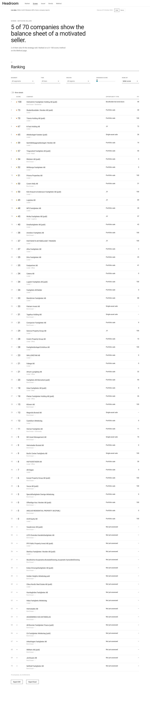
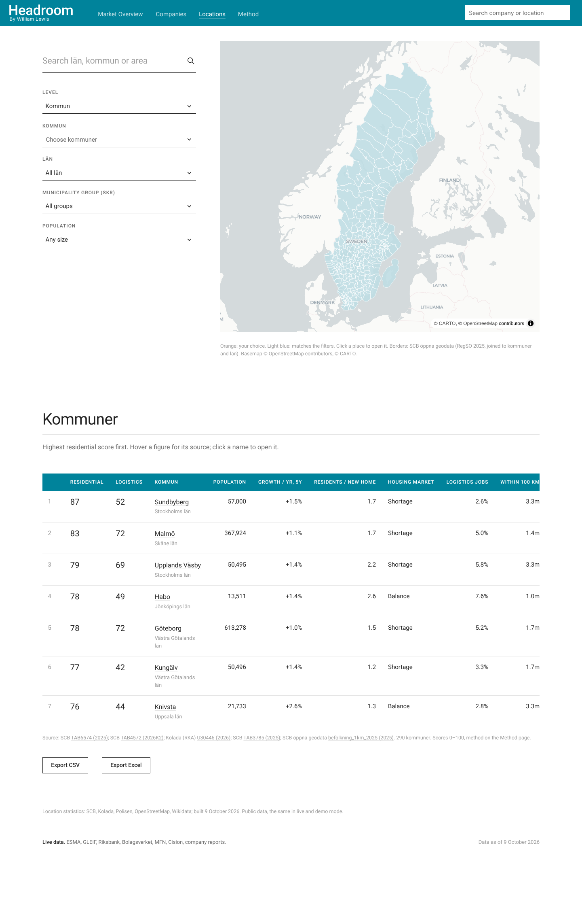
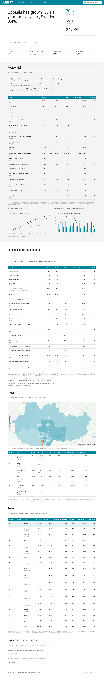

# Headroom

A Nordic property credit monitor. Headroom finds motivated sellers among Swedish property companies, listed and unlisted, from public data: leverage, refinancing pressure, bond covenants and credit events.

> Personal research project. Not affiliated with any investment firm. Not investment advice.
> The app also ships a **fictional demo dataset**, labelled as such on every page.



## What it catches

In July 2026 Holmström Fastigheter Holding AB (publ) started a written procedure on its senior secured bond: extend the maturity from October 2026 to April 2028 and allow an orderly sale of all group assets. Headroom finds this without manual input:

1. ESMA FIRDS lists the bond (SE0015797667) and its issuer LEI. GLEIF turns the LEI into org. nr 559286-6809.
2. MFN's company search links that org. number to the issuer's newswire feed.
3. The written procedure, the bondholder approval and the later agent decisions are classified as credit events.
4. The score (100/100) labels the opportunity a **bondholder-led wind-down**, and every line on the company page links to its source.


The app has four pages: **Companies** (the ranked list with key figures, filtered by company type, accounting standard, segment, county and city), **Locations** (place analysis for housing and logistics, below), **Underwriting** (the market evidence for pricing and financing a deal, below) and **Method**. Each company has its own page, opened from the tables or from the search box in the top-right corner. That box also finds counties, municipalities and areas: a place opens on Locations, and "Companies in …" opens the Companies list filtered to it.

### Locations

How Sweden's 21 counties (län), 290 municipalities (kommuner) and 3,363 areas (SCB's RegSO) develop, read for a value-add investor in rental housing and logistics / light industrial property. Every section answers what the numbers mean for a housing or a logistics investment there.

- **No place selected**: on the left the place search and the filters: **Level** (län, kommun or RegSO), then the places of that level to look at, then county, municipality (for RegSO), SKR municipality group (for kommuner) and population. On the right a map that lights up the chosen places in orange and the ones that match the filters in light blue; with RegSO as the level it draws the areas of the chosen municipality (click one on the map of Sweden to pick it). Below, a table of the places on a Residential and a Logistics score, with export to CSV and Excel. A click on the map or a name opens the place.
- **A place selected** (`?level=kommun&code=0380`, `lan`, `regso`): a headline chosen by rule from the indicator where the place differs most from Sweden; key facts with periods; **Residential** (growth, new residents per completed home, the inflow of 20–34-year-olds, the municipality's housing-market assessment, rents, new-build rent premium, charts); **Logistics and light industrial** (people within 50/100/200 km, nearest port, intermodal terminal, cargo airport, logistics jobs, commuting, industrial transaction prices); **Areas** (the RegSO as a table and a map; click to open); **Peers** (Kolada's similar municipalities, nearest neighbours in the same labour market, statistical twins, county and Sweden on the same rows); **Property companies here** (companies with a large share of their portfolio there, their seller score and a link to Companies).
- Every figure carries its period and source table; hover a figure to see its source, table, period, how it is computed and when it was retrieved. – means SCB suppresses or does not publish it. Police-listed vulnerable areas are outlined in orange on the maps and flagged in the tables. Cities (tätorter) are not pages of their own: their statistics stay in the snapshot, but the pages are län, kommun and RegSO.

The start page colours the map by the Residential or Logistics score (or by the filters).





### Underwriting

The evidence an acquisition case needs, for a municipality and a segment (residential, logistics, light industrial, community service, hotel, office, retail), optionally for a company from Companies (`?org=…`, `?kommun=…`, `?segment=…`). It works without a list of the target's properties.

- **Pricing**: prime yields by market from Cushman & Wakefield's MarketBeat, the valuation yields listed owners mark comparable stock at (Wallenstam, Sveafastigheter, Catena, Stenhus, Sagax, NP3, Hemsö, Pandox), SCB's sale prices against assessed values for the county, and transactions with a disclosed price.
- **Rents, vacancy and costs**: broker rents and vacancy, SCB's rents for the municipality and new-build presumption rents, listed owners' valuation assumptions and operating margins.
- **Financing**: Riksbank rates (policy rate, SWESTR, T-bill, 2/5/10-year government and mortgage bonds), SCB's rates on new bank loans to companies (TAB5780), the margins on every floating SEK property bond issued in the last eighteen months (FIRDS), the leverage of the listed owners, and published notes on bank and alternative lending (JLL, Nordic Credit Rating).
- **Demand** from Locations and **transaction volumes** from Cushman & Wakefield, Newsec, JLL, Colliers and Svefa.
- **A hold-period cash flow** prefilled from the above: levered and unlevered IRR, equity multiple, interest cover, debt yield, the price at a target IRR, a sensitivity table, and an Excel export where the model is live formulas (`model/underwriting.py`). For a company, price and NOI default to its property value and EBITDA, and the page shows the discount to book a buyer would need.

Published research is entered by hand in `config/underwriting/market.yaml`, every figure with publisher, report, period, page and link. Refresh it each quarter when the MarketBeats and interim reports are out.

## Why this matters for a value-add investor

*Draft. Rewrite in your own words.*

Value-add returns are made on entry price. The best entry prices come from sellers who must sell: an issuer whose bond falls due before its banks will refinance, whose interest cover is about to breach a covenant, or whose bondholders have already voted for a wind-down. These sellers rarely run a broad auction, so the deals are found off-market by whoever spots the pressure first.

That pressure is visible in public data before it becomes a sale. Bonds force unlisted companies to publish reports and bondholder notices; ESMA, GLEIF and Bolagsverket tie those filings to a company and its group. Headroom joins these sources on the organisation number and turns them into a ranked list of companies with a reason, a likely transaction type and a source for every figure. It is a sourcing tool, not a valuation tool: it says where to call, and why now.

## Status

| Milestone | Scope | State |
|---|---|---|
| 1 | Skeleton, theme, demo data | Done |
| 2 | ESMA FIRDS + GLEIF bond universe, maturity wall | Done |
| 3 | Listed KPIs via LLM extraction, share prices and NAV | Done |
| 4 | Bolagsverket private-AB screen | Code and tests done; runs when API credentials are set |
| 5 | Events from MFN and Cision releases and bondholder notices | Done |
| 6 | Scoring, issuer page, cited draft memo | Done |
| 7 | Tests, README, deployment | Done, except the Streamlit Cloud account step (below) |
| 8 | Locations: SCB, Kolada and geodata clients, indicators, scores, peers, RegSO areas and maps, place search | Done |

Live run of 9 October 2026: 70 property issuers (37 listed, 33 bond-only), 734 bonds, 64 newswire feeds found, 60 reports read for 35 companies, 258 events, 33 share-price series.

## Run it

Requires [uv](https://docs.astral.sh/uv/).

```bash
uv sync
uv run streamlit run app/streamlit_app.py      # http://localhost:8501, live and demo data
uv run headroom refresh                        # rebuild data/snapshots/live from public sources
uv run headroom locations                      # rebuild data/snapshots/locations only (SCB, Kolada, geodata)
uv run pytest                                  # tests, no network
```

Copy `.env.example` to `.env` and fill in:

| Variable | Needed for |
|---|---|
| `ANTHROPIC_API_KEY` (or `OPENAI_API_KEY` with `LLM_PROVIDER=openai`) | Report extraction, event classification, draft memos |
| `BOLAGSVERKET_CLIENT_ID`, `BOLAGSVERKET_CLIENT_SECRET` | SNI codes and private-AB annual reports |
| `BOLAGSVERKET_BULKFILE` | Path to Bolagsverket's bulk file of all companies, downloaded in a browser |
| `HTTP_CONTACT` | An email or repository URL appended to the user agent |

On Windows with the repository inside OneDrive, keep the virtual environment outside it: `setx UV_PROJECT_ENVIRONMENT %LOCALAPPDATA%\headroom-venv`, then open a new terminal.

## Pipeline

`uv run headroom refresh` runs end to end. `.github/workflows/refresh.yml` runs it every Thursday evening and commits the Parquet files together with `data/cache/llm.jsonl`, the stored LLM results, so a document is only ever sent to the model once; add the variables above as repository secrets.

1. **Bond universe.** Latest FIRDS full debt files are stream-parsed with `lxml.iterparse` (about 2 GB of XML) and deduplicated per ISIN. GLEIF batch lookups give legal name, country and org. number. Property issuers are kept by name keyword or a seed list (`config/universe_seed.yaml`); every Swedish issuer and the rule applied is saved in `issuer_audit.parquet`. FIRDS equity files add every Swedish company with shares on Nasdaq Stockholm, First North, Spotlight or NGM. Issuers whose name has no property word are checked against their main SNI code at Bolagsverket (68.1/68.2), which brings in property companies such as Arlandastad Group, Train Alliance and Bonäsudden; results are kept in `data/issuer_sni.csv`.
2. **Rates and FX** (used in the scoring, the rate-shock test and on Underwriting). Riksbank policy rate, SWESTR, 3-month treasury bill, 2/5/10-year government bonds and 2/5-year mortgage bonds, mid FX rates for EUR and NOK bonds, and SCB's rates on new bank loans to non-financial companies (`sources/lending.py`).
3. **Newswire feeds.** MFN company search returns each entity's org. numbers, LEIs and tickers, so feeds are matched on identifiers. Cision pages are the fallback, accepted only on an exact name or brand-name match; when an issuer has both an old archive page and an active newsroom, the most recently active one is used.
4. **Reports.** The two latest interim reports per company (titles matched in Swedish and English, including headline-style titles such as "... för perioden januari–juni" or "Q2 2026 Results") are downloaded, with the annual report as fallback; anything older than two years is skipped. In each PDF the pages with key figures are picked by keyword scoring, and an LLM returns typed figures with page, quote and confidence (Pydantic structured output). Code derives the rest and labels it derived: LTV from net debt and property value, annualised interest, EBITDA from ICR × interest, and debt due within 12 and 24 months from the maturity table. Results are cached by document hash.
5. **Events.** Release titles are filtered by keyword; candidates are read in full and classified by a fast model into written procedure, waiver, deferral, reconstruction, bankruptcy, liquidation, going concern, disposal (below book or not), downgrade, refinancing or equity raise.
6. **Prices.** Weekly closes from Yahoo Finance; NAV per share from reports is attached as of each report's publication date.
7. **Location** (`model/geo.py`). County and city from the registered address at Bolagsverket (municipality table from Statistics Sweden, postcode prefixes as fallback); listed companies and bond issuers are placed where the largest share of their portfolio is when the report names a Swedish place.
8. **Market vs book value** (`model/valuation.py`). Every property value is labelled fair value (stated in the source), fair value presumed (IFRS report, basis not stated) or book value (K2/K3). Annual reports use the fair value disclosed in the notes when there is one. LTV on book value is flagged in the app.
9. **Private ABs** (`sources/bolagsverket.py`). Candidates come from Bolagsverket's bulk file: SNI 68 where the file has it, otherwise wording in the name or registered business description ("äga och förvalta fast egendom", "uthyrning av lokaler" and similar), most likely first. The candidate list is saved to `data/private_candidates.parquet` so the scheduled job can use it without the bulk file. Each candidate's SNI code is checked through the API, its latest digitally filed annual report (iXBRL) is parsed, and those with at least SEK 20m of property are scored. `data/private_checked.csv` records every result and coverage grows run by run. A separate workflow (`.github/workflows/private.yml`, `headroom private`) runs four times a day for up to 5.5 hours each, checking candidates at Bolagsverket's rate limit (it slows down by itself on HTTP 429). Kept companies go to `data/private_found.jsonl`, which the app merges into the live data, so the private scan and the weekly refresh never write the same files. Companies registered in the last 15 months are skipped, as they have not filed an annual report yet. It uses no LLM, so it costs nothing. Late annual reports and registered proceedings become events.
10. **Locations** (`location_pipeline.py`, `uv run headroom locations`; also run by `headroom refresh`). SCB PxWebApi 2.0 (`sources/scb.py`): reads `/config`, splits selections over the 150,000-cell limit, keeps to 30 calls per 10 seconds and backs off on 429, turns json-stat2 into long Polars frames with SCB's dots as null, and caches each table selection as Parquet, skipping the download while the table's `updated` stamp is unchanged. Kolada v3 (`sources/kolada.py`) adds the housing-market assessment, unemployment, tax base and the "Liknande kommuner socioekonomi" peer groups. SCB's WFS (`sources/scb_geo.py`) gives RegSO 2025 polygons (joined into municipality and county borders), cities, the 1 km population grid and business areas; distances are computed in SWEREF 99 TM and maps written as simplified GeoJSON per municipality. Output: `data/snapshots/locations/` (`location`, `location_indicator` in long format with source table, URL and as-of per row, `location_score`, `location_peer`, `geo/`). It is public data, shown in both live and demo mode. Building it needs shapely (`geo` dependency group, installed by `uv sync`); the app does not.

## Scoring

Motivated-seller score, 0 to 100: refinancing pressure 30%, covenant headroom 25%, leverage and coverage 15%, events 20% (half-life 180 days), market 10% (listed only). Missing components are dropped and the rest re-weighted, and the company is flagged; below 50% coverage a company is not scored. When the reported maturity profile is missing, bond maturities from FIRDS are used and labelled as such. Strategy fit measures exposure to residential, light industrial and logistics property, to Nordic growth regions, and to a target deal size. All weights are in `config/weights.yaml` and on the Method page.

Location scores (Locations page only; they do not touch the company scores): **Residential** for municipalities and counties (5-year growth 20%, new residents per completed home 20%, net inflow of 20–34-year-olds 15%, housing-market assessment 15%, homes started 10%, income vs Sweden 10%, higher education 10%), **Residential** for RegSO areas (growth 25%, share aged 20–34 15%, rental share 15%, socio-economic improvement over ten years 20%, income vs the municipality 15%, the municipality's score 10%) and **Logistics** for municipalities and counties (people within 100 km 30%, transport and warehousing jobs vs Sweden 20% and their growth 10%, nearest port/terminal/cargo airport 20%, in- vs out-commuters 10%, business-area jobs per resident 10%). Same rules as above: linear ramps, missing components re-weighted, no score below 50% coverage. The ramps were set against the 2025–2026 distribution of each indicator.

## Deploy to Streamlit Community Cloud

1. Push the repository to GitHub (public).
2. On share.streamlit.io, choose **New app**, pick the repository, branch `main`, main file `app/streamlit_app.py`. Dependencies install from `requirements.txt`.
3. Under **Advanced settings → Secrets**, add `ANTHROPIC_API_KEY = "..."` to enable draft memos. Without it the app runs read-only on the committed snapshots.

## Decisions

- **Fit score is named "Strategy fit"**, not after any firm.
- **Demo data is unmistakably fictional**: Greek-letter names, org numbers `DEMO-NNN`, ISINs `SEDEMO…`, sources `demo://`.
- **Snapshots are Parquet** queried through in-memory DuckDB; the weekly job commits plain files.
- **Field-level provenance**: source URL, page, confidence and method (extracted or derived) for every figure; below 0.80 confidence a value shows as unverified.
- **Private companies whose main SNI code is not 68** (a gravel pit, a forestry company, a care home that owns its building) are left out of Companies unless their name says they are a property company; **single-asset subsidiaries of listed groups**, recognised by name (`config/groups.yaml`), are hidden from the ranking by default.
- **Implausible ratios are not shown**: ICR above 20x shows as "> 20x", net debt/EBITDA above 50x as "> 50x"; an average rate outside 0–15% or an LTV outside 0–150% shows "–" with a Check flag.
- **STIBOR is not free**: the Riksbank stopped publishing it in 2020, so the rate panel uses the policy rate, SWESTR and the 3-month treasury bill.
- **Issue date is the first trading date** in FIRDS; **secured** comes from the CFI code.
- **MFN robots.txt** disallows its RSS/JSON feeds, so the HTML pages and company search are used instead. **Post- och Inrikes Tidningar** and Bolagsverket's website block automated access and are not scraped.
- **Models**: `claude-sonnet-5-5` for reports and memos, `claude-haiku-5-5` for event classification; change in `.env`.
- **Opportunity type is rule-based** and transparent (`model/scoring.py`); the LLM extracts and drafts, it does not score.
- **Locations sources.** SCB tables were checked against the API in October 2026; where the brief's table did not hold the level needed, another was used: TAB6574 for population (5-year age bands, so 20–34 can be built; TAB7046 has 10-year bands), TAB3204/TAB3785 for jobs at the workplace by industry per municipality (TAB5458 only covers counties and FA regions), TAB6534 for education. SNI 46 (wholesale) is not published per municipality, so logistics is SNI H and light industry SNI B+C and F. Rents per municipality exist only for the 20 largest municipalities (TAB4603) and new-build rent premiums only for the three metro regions and two size groups (TAB6417). Vacant flats (TAB3214) are national only, so the housing-market assessment stands in for vacancy risk. Industrial assessed values have no floor area, so they are per taxation unit.
- **RegSO versions.** Statistics from 2024 use RegSO 2025, earlier years RegSO 2020. Some tables return 0 rather than '..' outside a version's years, so rows are dropped by version and year, never by value. SCB's change file (`config/geo/regso_changes.csv`, 2026-03-25) lists 288 of 3,363 areas whose borders changed; their series break in 2024 and are flagged. Name changes and extensions into territorial water keep the series.
- **Straight lines, not drive times.** Catchments and distances are straight lines from a population-weighted centre on SCB's 1 km grid. The app says so next to each figure.
- **Hand-entered location sources** live in `config/geo` with source and date: Polisen's Lägesbild över utsatta områden 2025 (65 areas; the risk-area category was dropped in 2025; linked to RegSO by name, approximately), logistics nodes (ports, intermodal terminals and cargo airports with Wikidata/OpenStreetMap ids; not exhaustive) and logistics rankings. Distance to motorway junctions is not part of the Logistics score. Intelligent Logistik's ranking ended in 2024; Dagens Logistik's 2026 list ranks nine Nordic regions and is shown but not scored. Market yields, rents and volumes from broker research are used on Underwriting only, entered by hand with their source (`config/underwriting/market.yaml`); they do not feed any score.
- **Not used**: Svensk Mäklarstatistik (its licence forbids giving third parties access), and paid services such as Datscha, Valueguard and Pamind (possible additions).
- **Place search** on Locations is a small Streamlit component (components v2, no iframe) so result rows can show the name large and level and parent muted; it searches in the browser over the place index. The header keeps streamlit_searchbox and searches companies and places; companies, counties and municipalities rank before postal towns, towns before areas. Source on hover is one small module (`app/ui/source_tips.py`) that places a box next to any figure with a `data-src` attribute, so it is never clipped by a scrolling table.
- **Visual style**: large statements, hairline rules, white and light-grey bands, Roboto, one blue accent (#00839B), orange for breach and amber for watch.

## Layout

```
src/headroom/   sources/ (firds, gleif, riksbank, newsfeeds, prices, bolagsverket, scb, scb_geo, kolada)
                extract/ (documents, llm, kpi, events, memo)
                model/ (scoring, stress, universe, geo, location, search)
                store/ (DuckDB over Parquet)  pipeline.py  location_pipeline.py  cli.py  demo/
app/            streamlit_app.py, views/, ui/ (theme.css, plotly_template.py, components)
config/         weights.yaml, universe_seed.yaml, geo/ (municipalities, RegSO changes, vulnerable areas,
                logistics nodes, logistics rankings), groups.yaml, underwriting/market.yaml
data/snapshots/ demo/, live/ and locations/ (committed); data/cache/ is not
tests/
```

## License

MIT
