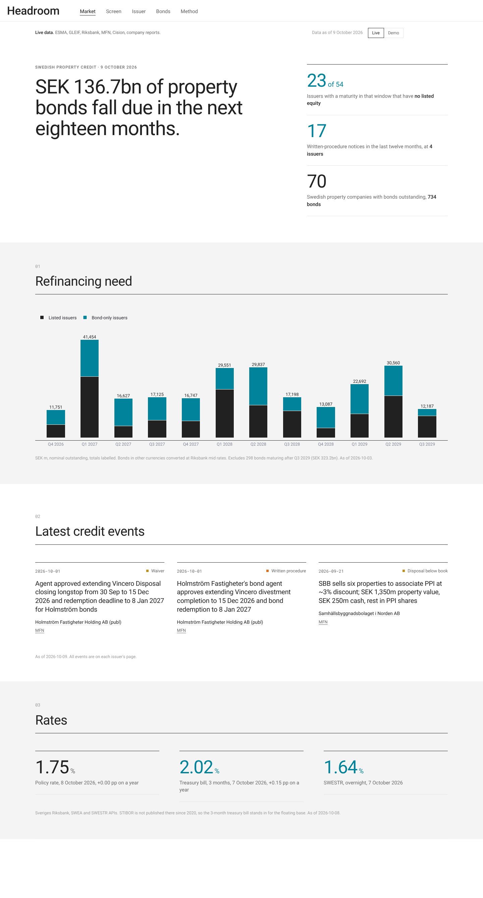
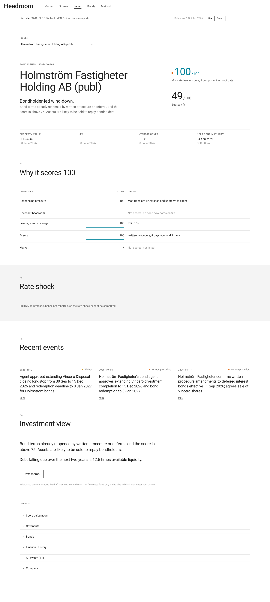

# Headroom

A Nordic property credit monitor. Headroom finds motivated sellers among Swedish property companies, listed and unlisted, from public data: leverage, refinancing pressure, bond covenants and credit events.

> Personal research project. Not affiliated with any investment firm. Not investment advice.
> The app also ships a **fictional demo dataset**, labelled as such on every page.



## What it catches

In July 2026 Holmström Fastigheter Holding AB (publ) started a written procedure on its senior secured bond: extend the maturity from October 2026 to April 2028 and allow an orderly sale of all group assets. Headroom finds this without manual input:

1. ESMA FIRDS lists the bond (SE0015797667) and its issuer LEI. GLEIF turns the LEI into org. nr 559286-6809.
2. MFN's company search links that org. number to the issuer's newswire feed.
3. The written procedure, the bondholder approval and the later agent decisions are classified as credit events.
4. The score (100/100) labels the opportunity a **bondholder-led wind-down**, and every line on the issuer page links to its source.



## Why this matters for a value-add investor

*Draft. Rewrite in your own words.*

Value-add returns are made on entry price. The best entry prices come from sellers who must sell: an issuer whose bond falls due before its banks will refinance, whose interest cover is about to breach a covenant, or whose bondholders have already voted for a wind-down. These sellers rarely run a broad auction, so the deals are found off-market by whoever spots the pressure first.

That pressure is visible in public data before it becomes a sale. Bonds force unlisted companies to publish reports and bondholder notices; ESMA, GLEIF and Bolagsverket tie those filings to a company and its group. Headroom joins these sources on the organisation number and turns them into a ranked list of companies with a reason, a likely transaction type and a source for every figure. It is a sourcing tool, not a valuation tool: it says where to call, and why now.

## Status

| Milestone | Scope | State |
|---|---|---|
| 1 | Skeleton, theme, demo data | Done |
| 2 | ESMA FIRDS + GLEIF bond universe, maturity wall | Done |
| 3 | Listed KPIs via LLM extraction, share prices and NAV | Done |
| 4 | Bolagsverket private-AB screen | Code and tests done; runs when API credentials are set |
| 5 | Events from MFN and Cision releases and bondholder notices | Done |
| 6 | Scoring, issuer page, cited draft memo | Done |
| 7 | Tests, README, deployment | Done, except the Streamlit Cloud account step (below) |

Live run of 9 October 2026: 70 property issuers (37 listed, 33 bond-only), 734 bonds, 64 newswire feeds found, 60 reports read for 35 companies, 258 events, 33 share-price series.

## Run it

Requires [uv](https://docs.astral.sh/uv/).

```bash
uv sync
uv run streamlit run app/streamlit_app.py      # http://localhost:8501, live and demo data
uv run headroom refresh                        # rebuild data/snapshots/live from public sources
uv run pytest                                  # 63 tests, no network
```

Copy `.env.example` to `.env` and fill in:

| Variable | Needed for |
|---|---|
| `ANTHROPIC_API_KEY` (or `OPENAI_API_KEY` with `LLM_PROVIDER=openai`) | Report extraction, event classification, draft memos |
| `BOLAGSVERKET_CLIENT_ID`, `BOLAGSVERKET_CLIENT_SECRET` | SNI codes and private-AB annual reports |
| `BOLAGSVERKET_BULKFILE` | Path to Bolagsverket's bulk file of all companies, downloaded in a browser |
| `HTTP_CONTACT` | An email or repository URL appended to the user agent |

On Windows with the repository inside OneDrive, keep the virtual environment outside it: `setx UV_PROJECT_ENVIRONMENT %LOCALAPPDATA%\headroom-venv`, then open a new terminal.

## Pipeline

`uv run headroom refresh` runs end to end. `.github/workflows/refresh.yml` runs it every Thursday evening and commits the Parquet files together with `data/cache/llm.jsonl`, the stored LLM results, so a document is only ever sent to the model once; add the variables above as repository secrets.

1. **Bond universe.** Latest FIRDS full debt files are stream-parsed with `lxml.iterparse` (about 2 GB of XML) and deduplicated per ISIN. GLEIF batch lookups give legal name, country and org. number. Property issuers are kept by name keyword or a seed list (`config/universe_seed.yaml`); every Swedish issuer and the rule applied is saved in `issuer_audit.parquet`. FIRDS equity files mark which issuers have listed shares.
2. **Rates and FX.** Riksbank policy rate, SWESTR, 3-month treasury bill, and mid FX rates for EUR and NOK bonds.
3. **Newswire feeds.** MFN company search returns each entity's org. numbers, LEIs and tickers, so feeds are matched on identifiers. Cision pages are the fallback, accepted only on an exact name or brand-name match; when an issuer has both an old archive page and an active newsroom, the most recently active one is used.
4. **Reports.** The two latest interim reports per company (titles matched in Swedish and English, including headline-style titles such as "... för perioden januari–juni" or "Q2 2026 Results") are downloaded, with the annual report as fallback; anything older than two years is skipped. In each PDF the pages with key figures are picked by keyword scoring, and an LLM returns typed figures with page, quote and confidence (Pydantic structured output). Code derives the rest and labels it derived: LTV from net debt and property value, annualised interest, EBITDA from ICR × interest, and debt due within 12 and 24 months from the maturity table. Results are cached by document hash.
5. **Events.** Release titles are filtered by keyword; candidates are read in full and classified by a fast model into written procedure, waiver, deferral, reconstruction, bankruptcy, liquidation, going concern, disposal (below book or not), downgrade, refinancing or equity raise.
6. **Prices.** Weekly closes from Yahoo Finance; NAV per share from reports is attached as of each report's publication date.
7. **Market vs book value** (`model/valuation.py`). Every property value is labelled fair value (stated in the source), fair value presumed (IFRS report, basis not stated) or book value (K2/K3). Annual reports use the fair value disclosed in the notes when there is one. LTV on book value is flagged in the app.
8. **Private ABs** (`sources/bolagsverket.py`). Candidates come from Bolagsverket's bulk file: SNI 68 where the file has it, otherwise wording in the name or registered business description ("äga och förvalta fast egendom", "uthyrning av lokaler" and similar), most likely first. The candidate list is saved to `data/private_candidates.parquet` so the scheduled job can use it without the bulk file. Each candidate's SNI code is checked through the API, its latest digitally filed annual report (iXBRL) is parsed, and those with at least SEK 20m of property are scored. `data/private_checked.csv` records every result and coverage grows run by run. A separate workflow (`.github/workflows/private.yml`, `headroom private`) runs four times a day for up to 5.5 hours each, checking candidates at Bolagsverket's rate limit (it slows down by itself on HTTP 429). Kept companies go to `data/private_found.jsonl`, which the app merges into the live data, so the private scan and the weekly refresh never write the same files. Companies registered in the last 15 months are skipped, as they have not filed an annual report yet. It uses no LLM, so it costs nothing. Late annual reports and registered proceedings become events.

## Scoring

Motivated-seller score, 0 to 100: refinancing pressure 30%, covenant headroom 25%, leverage and coverage 15%, events 20% (half-life 180 days), market 10% (listed only). Missing components are dropped and the rest re-weighted, and the company is flagged; below 50% coverage a company is not scored. When the reported maturity profile is missing, bond maturities from FIRDS are used and labelled as such. Strategy fit measures exposure to residential, light industrial and logistics property, to Nordic growth regions, and to a target deal size. All weights are in `config/weights.yaml` and on the Method page.

## Deploy to Streamlit Community Cloud

1. Push the repository to GitHub (public).
2. On share.streamlit.io, choose **New app**, pick the repository, branch `main`, main file `app/streamlit_app.py`. Dependencies install from `requirements.txt`.
3. Under **Advanced settings → Secrets**, add `ANTHROPIC_API_KEY = "..."` to enable draft memos. Without it the app runs read-only on the committed snapshots.

## Decisions

- **Fit score is named "Strategy fit"**, not after any firm.
- **Demo data is unmistakably fictional**: Greek-letter names, org numbers `DEMO-NNN`, ISINs `SEDEMO…`, sources `demo://`.
- **Snapshots are Parquet** queried through in-memory DuckDB; the weekly job commits plain files.
- **Field-level provenance**: source URL, page, confidence and method (extracted or derived) for every figure; below 0.80 confidence a value shows as unverified.
- **STIBOR is not free**: the Riksbank stopped publishing it in 2020, so the rate panel uses the policy rate, SWESTR and the 3-month treasury bill.
- **Issue date is the first trading date** in FIRDS; **secured** comes from the CFI code.
- **MFN robots.txt** disallows its RSS/JSON feeds, so the HTML pages and company search are used instead. **Post- och Inrikes Tidningar** and Bolagsverket's website block automated access and are not scraped.
- **Models**: `claude-sonnet-5-5` for reports and memos, `claude-haiku-5-5` for event classification; change in `.env`.
- **Opportunity type is rule-based** and transparent (`model/scoring.py`); the LLM extracts and drafts, it does not score.
- **Visual style**: large statements, hairline rules, white and light-grey bands, Roboto, one blue accent (#00839B), orange for breach and amber for watch.

## Layout

```
src/headroom/   sources/ (firds, gleif, riksbank, newsfeeds, prices, bolagsverket)
                extract/ (documents, llm, kpi, events, memo)  model/ (scoring, stress, universe)
                store/ (DuckDB over Parquet)  pipeline.py  cli.py  demo/
app/            streamlit_app.py, views/, ui/ (theme.css, plotly_template.py, components)
config/         weights.yaml, universe_seed.yaml
data/snapshots/ demo/ and live/ (committed); data/cache/ is not
tests/
```

## License

MIT
